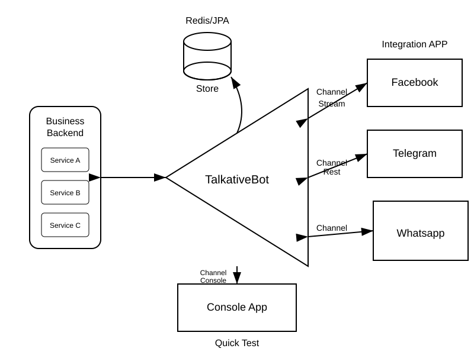

# TalkativeBot

> A Java 17 / Spring Boot 3.4 conversation workflow runtime for building stateful, resumable, channel-agnostic, humam-in-the-loop flows.

[](https://www.oracle.com/java/)
[](https://spring.io/projects/spring-boot)
[](LICENSE)


## Table of Contents

- [Overview](#overview)
- [What It Is Not](#what-it-is-not)
- [Architecture](#architecture)
- [Why TalkativeBot?](#why-talkativebot)
- [Key Features](#key-features)
- [Modules](#modules)
- [Documentation](#documentation)
- [Requirements](#requirements)
- [Installation](#installation)
- [Spring Boot Configuration](#spring-boot-configuration)
- [Persistence Options](#persistence-options)
- [Quick Start](#quick-start)
- [Core Concepts](#core-concepts)
    - [Conversations](#conversations)
    - [Conversation Runtime](#conversation-runtime)
    - [Topics](#topics)
- [Production-readiness](#production-readiness)

## Overview

TalkativeBot provides a conversation orchestration layer that decouples your business logic from chat platforms,
messaging systems, and AI engines. It has a small core engine plus a Spring Boot starter for auto-configuration,
pluggable input/output channels, and durable pending-interaction storage using
in-memory, Redis, or JPA-backed stores.

## What It Is Not
TalkativeBot is **not a workflow engine (eg. no BPMN files), chatbot platform, or AI framework**. It's a lightweight Java/Spring conversation state manager for human-in-the-loop workflows. It focuses on asking questions, persisting pending interactions, resuming conversations, and keeping transport-specific code outside business logic.

## Architecture

TalkativeBot acts as a central orchestration hub that decouples business conversation logic from the underlying messaging channels and infrastructure.



The flow is intentionally simple: **ask → persist pending state → resume when the user replies**, without rewriting your conversation logic per channel.

| Layer | Responsibility |
|-------|----------------|
| **Transport** | Console, Spring Cloud Stream, or custom channels (pluggable) |
| **talkativebot-spring-boot-starter** | Auto-configuration, channel adapters, topic scanning, store backends |
| **talkativebot-core** | `TalkativeBot` orchestration — `handle()`, `play()`, `ask()` |
| **Your application** | `AbstractConversation`, `@Topic` classes, `ConversationStartResolver` |
| **Persistence** | `PendingInteractionStore` — memory, Redis, or JPA (question + facts + TTL) |

## Why TalkativeBot?

Getting your application AI-ready is not only about plugging in a model or adding a chatbot. A good first step is giving
your product a clean way to hold structured, stateful conversations—making AI-driven bots just another client of your
application.

### The Problem

Many business flows eventually need human interaction:

- Collecting missing information
- Confirming a decision
- Selecting from available options
- Approving or rejecting an action
- Clarifying an exception
- Resuming a workflow after a user response

When this logic is handled directly inside controllers, services, message consumers, or bot-specific integrations, the
application quickly becomes coupled to a particular channel or provider.

### The Solution

TalkativeBot provides a conversation orchestration layer between your application and the bot engines, messaging
platforms, and AI tools around it.

Wherever your business flow needs human input, you can delegate that interaction to a bot while keeping your core
application logic independent from the transport layer.

**TalkativeBot helps you model interactions as conversations:**

- Ask a question
- Wait for an answer
- Persist the pending interaction
- Resume the flow when the answer arrives
- Route messages through the appropriate channel

**The goal is not to replace AI engines or chat platforms.** The goal is to give your application a predictable layer
for managing conversations across them—providing these abstractions without tying your conversation logic to a specific
transport.

## Key Features

- **Conversation Flow Abstraction** – Define complex, stateful conversations as reusable components
- **Multi-Channel Support** – Deploy the same conversation across Console, REST API, Spring Cloud Stream, and custom
  channels
- **Flexible Persistence** – Choose from in-memory, Redis, or JPA storage, or implement your own
- **Question/Answer Handling** – Built-in support for text input, single/multiple choice, and custom question types
- **Spring Boot Integration** – Auto-configuration and starter for seamless integration
- **Extensible Architecture** – Add custom channels (WhatsApp, Telegram, Facebook Messenger) and storage backends

## Modules

| Module                             | Purpose                                         |
|------------------------------------|-------------------------------------------------|
| `talkativebot-core`                | Framework-independent conversation engine       |
| `talkativebot-spring-boot-starter` | Spring Boot auto-configuration and integrations |
| `talkativebot-docs`                | Reference documentation (Asciidoctor)           |

## Documentation

Comprehensive reference documentation is available in the `talkativebot-docs` module.

### Building Documentation

To generate the HTML reference guide and aggregate Javadocs, run:

```bash
./mvnw clean prepare-package javadoc:aggregate -DskipTests
```

The generated documentation will be available at:
- Reference Guide: `talkativebot-docs/target/generated-docs/index.html`
- Javadocs: `target/site/apidocs/index.html`

## Requirements
- Java 17+
- Spring Boot 3.4+

## Installation
### Maven

```xml
<dependency>
    <groupId>com.atchurey.tools</groupId>
    <artifactId>talkativebot-spring-boot-starter</artifactId>
    <version>0.0.7-SNAPSHOT</version>
</dependency>
```


## Spring Boot Configuration

> [!IMPORTANT]
> Configure `atchurey.tools.talkativebot.topic-base-package` to the package that contains your `@Topic` classes (for example `com.example.myapp.topics`). **Topic scanning does not run without this property** — conversations will start with no topics registered.

```properties
atchurey.tools.talkativebot.pending-interaction.store=memory | redis | database
atchurey.tools.talkativebot.pending-interaction.ttl=30m
# Required — base package for @Topic classpath scanning
atchurey.tools.talkativebot.topic-base-package=com.example.basepackage
atchurey.tools.talkativebot.channels.enabled=true
atchurey.tools.talkativebot.channels.console-enabled=true
```

## Persistence Options

1. `memory` - In-memory store.
2. `redis` - Redis store.
3. `database` - JPA store.

## Quick Start
Manually play a conversation by calling `TalkativeBot.play(...)`.
```java
@Autowired
TalkativeBot talkativebot;

ConversationAddress consoleAddress = new ConversationAddress(
		"console",
		"console-user-1",
		"console-session-1"
);
talkativebot.play(new SaleConversation(talkativebot, consoleAddress));
```

Or automatically trigger a conversation flow when a user sends a message to the bot by implementing a `ConversationStartResolver`.
```java
@Component
public class SaleConversationStartResolver implements ConversationStartResolver {

    @Override
    public Optional<ConversationStartRequest> resolve(IncomingMessage message) {
        if (!"/start".equalsIgnoreCase(message.getText().trim())) {
            return Optional.empty();
        }

        return Optional.of(new ConversationStartRequest(
                message.getAddress(),
                SaleConversation.class.getName(),
                "/start",
                Map.of(
                        "source_channel", message.getAddress().getChannel(),
                        "external_user_id", valueOrEmpty(message.getAddress().getUserId())
                )
        ));
    }

    private Serializable valueOrEmpty(String value) {
        return value == null ? "" : value;
    }
}
```

## Core Concepts

TalkativeBot models human-in-the-loop work as **conversations** made of **topics**. **Facts** hold durable step state across async replies; the **conversation runtime** holds per-JVM infrastructure (clients, services) that should not be serialized into pending interactions.

See `example-stream-redis/agent-one` for a full distributed example (Redis pending store + Spring Cloud Stream).

### Conversations

Conversations are stateful. A `Conversation` orchestrates the flow based on the associated `Topic` definitions. It is defined by a class that extends `AbstractConversation`. 
You can simply only override the `onTopicPlayed` method to handle topic events. If you need to handle conversation-level flow completion, 
override the `onConversationClosed` callback,

```java
public class SaleConversation extends AbstractConversation<String> {

    public SaleConversation(TalkativeBot bot, ConversationAddress address) {
        super(bot, address);
    }

    @Override
    protected CompletableFuture<String> onTopicPlayed(ConversationTopic topic) {
        if (isClosed()) {
            return onConversationClosed();
        }

        return CompletableFuture.completedFuture("Played topic: " + topic.getKey());
    }

    @Override
    protected CompletableFuture<String> onConversationClosed() {
        return bot.reply("Sale conversation completed.");
    }
    
}
```

### Conversation Runtime

`ConversationRuntime` is an in-memory resource bag for infrastructure your conversation type needs (`WebClient`, repositories, compiled templates, API helpers). It is **not** durable state. Put user choices, step flags, and identifiers in `Facts` so they survive async gaps, multi-service instances, or a service restart.

- One runtime per conversation **type** per JVM (shared clients, not per user session).
- Each application instance builds its own registry. No distributed runtime cache needed for expensive resources.
- `TalkativeBot` hydrates the runtime on every `play()` and inbound `handle()` resume.

Register resources with a `ConversationRuntimeInitializer` bean (`example-stream-redis/agent-one`):

```java
@Component
public class JokeFactoryConversationRuntimeInitializer
        implements ConversationRuntimeInitializer {

    private final WebClient.Builder webClientBuilder;

    public JokeFactoryConversationRuntimeInitializer(WebClient.Builder webClientBuilder) {
        this.webClientBuilder = webClientBuilder;
    }

    @Override
    public boolean supports(Class<? extends Conversation<?>> conversationType) {
        return JokeFactoryConversation.class.equals(conversationType);
    }

    @Override
    public ConversationRuntime initialize(Class<? extends Conversation<?>> conversationType) {
        WebClient webClient = webClientBuilder
                .baseUrl("https://official-joke-api.appspot.com")
                .build();

        JokeFactoryRuntime runtime = new JokeFactoryRuntime(webClient);

        return DefaultConversationRuntime.builder()
                .put(JokeFactoryRuntimeKeys.RUNTIME, runtime)
                .put(JokeFactoryRuntimeKeys.JOKE_WEB_CLIENT, webClient)
                .build();
    }
}
```

Expose helpers on the conversation (`JokeFactoryConversation` in agent-one):

```java
public JokeFactoryRuntime jokeFactoryRuntime() {
    return getRuntime().get(
            JokeFactoryRuntimeKeys.RUNTIME,
            JokeFactoryRuntime.class
    );
}
```

Use the runtime in topics for I/O; keep flow state in facts (`JokeFactoryTopic`):

```java
@Override
protected void doPlay(Facts facts) {
    JokeFactoryRuntime runtime = conversation.jokeFactoryRuntime();
	
    JokeFactoryRuntime.Joke joke = runtime.generateJoke(facts.get("joke_type"));
    getBot().ask(conversation, this, Question.choice(joke.getSetup(),
            new Option[]{ new Option(joke.getId(), "What?") }));
}

```

### Topics

For a given conversation, you can define multiple topics. Each topic is a stateful conversation flow. 
1. The topic `key` is used to identify the topic in the conversation state.
2. The topic `name` can be a user/developer friendly text only used for display.
3. The topic `description` is to provide a brief description of the topic.
4. The topic `conversation` is the class that this `Topic` is part of.
5. The topic `canReplay` flag indicates whether the topic can be replayed after it has been closed/completed.
6. The topic `next` is the key of the next topic to play after the current one finishes. If set and the target topic is playable, it takes precedence over `order` for that step.
7. The topic `order` controls registration sort order and selects the first playable topic when there is no current topic, or when `next` is unset, points to a missing topic, or the target is not playable.

```java
@Topic(
		key = "payment_method",
		name = "Payment Method",
		description = "Choose your payment method",
		conversation = SaleConversation.class,
		canReplay = true,
		next = "complete_sale",
		order = 4
)
public class PaymentMethodTopic extends AbstractTopic {
	protected final Logger logger = LoggerFactory.getLogger(getClass());

	public PaymentMethodTopic(Conversation<?> conversation) {
		super(conversation);
	}

	@Override
	protected boolean canPlayWithFacts(@NonNull Facts facts) {
		return true;
	}

	@Override
	protected void doPlay(Facts facts) {
		Question question = new Question("Choose your payment method.",
				new Option[]{
						new Option(0, "CARD"),
						new Option(1, "CASH")
				}
		);

		getBot().ask(conversation, this, question);
	}

	@Override
	public void onInput(SelectedAnswer selectedAnswer) {
		logger.info("User selected payment method: {}", selectedAnswer.getText());
	}
}
```
## Production-readiness

TalkativeBot is currently pre-v1.0. Till then, it is suitable for prototypes, internal tools, and controlled production experiments.

Supported:
- resumable pending interactions
- pluggable output/input channels
- in-memory, Redis, and JPA pending stores
- Spring Boot auto-configuration
- conversation runtime rehydration

Current limitations:
- no built-in distributed locking
- no built-in retry/dead-letter strategy
- no built-in metrics/tracing module yet
- conversation API may change before 1.0

Find the TODO list in the [reference documentation](#documentation).

## Versioning

TalkativeBot follows semantic versioning after 1.0.

Before 1.0, public APIs may change between minor versions. Public extension points
are documented in the [reference documentation](#documentation).
